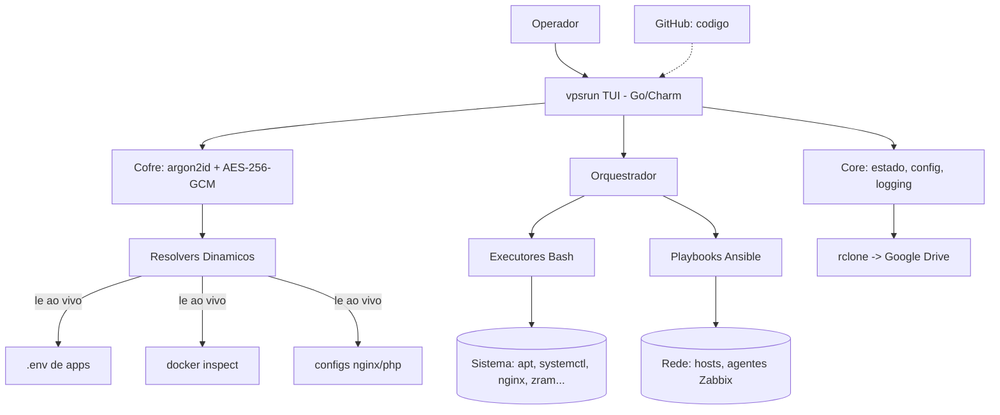

# Design Document — vpsrun

## Overview

O `vpsrun` adota uma **arquitetura de duas camadas**:

1. **Camada de aplicação (Go)** — a interface TUI, o cofre criptográfico, o estado, os resolvers dinâmicos e a orquestração. Compila para um binário estático único, sem dependências de runtime no destino, e permite compilação multiplataforma (Linux/Windows) futura sem reescrever a lógica.
2. **Camada de execução (Bash + Ansible)** — os scripts que já existem em `~/Documents/VPSRUN/` (setup-vps.sh, backup-vps.sh, etc.) e playbooks Ansible, chamados pela camada Go. Cada ação de sistema fica isolada, auditável e editável.

Essa separação preserva o investimento em Bash, mantém cada ação transparente e concentra em Go apenas o que Bash faz mal: UI rica, criptografia, estado e portabilidade.

### Decisões principais
- **Linguagem/UI**: Go + ecossistema Charm (Bubble Tea para o loop de UI, Lipgloss para estilo, Huh para formulários, Glamour para render de manuais em Markdown).
- **Cofre**: modelo "Segredos Estáticos + Resolvers Dinâmicos". Chave derivada da Senha_Master via argon2id; cifragem AES-256-GCM. A Senha_Master nunca é persistida.
- **Distribuição**: binário único; Kit_Portátil em `.tar.zst` (ou `makeself` `.run`); código no GitHub, segredos/backup cifrados no Google Drive via rclone (já configurado, remote `gdrive`).
- **Backup**: avaliar `restic` para dedup + criptografia + incremental, substituindo tar cru.
- **Standalone**: `vpsrun-audit` como alvo de build separado via build tags, sem os módulos de servidor.

## Architecture



### Estrutura de diretórios do projeto
```
VPSRUN/
├── cmd/
│   ├── vpsrun/            # entrypoint edicao server
│   └── vpsrun-audit/      # entrypoint edicao standalone (build tag)
├── internal/
│   ├── ui/                # Bubble Tea models, telas, navegacao
│   ├── vault/             # KDF, cifra, schema, resolvers
│   ├── resolvers/         # leitura dinamica (.env, docker, nginx)
│   ├── modules/           # install, monitor, backup, tuning, updates, audit
│   ├── exec/              # wrapper para chamar Bash/Ansible com segurança
│   └── core/              # config, logging, estado, inventario
├── scripts/               # Executores Bash (setup-vps.sh, backup-vps.sh, ...)
├── ansible/               # playbooks, inventário dinâmico, roles (zabbix-agent, discovery)
├── templates/             # daemon.json, logrotate, sysctl, zram, systemd units
├── docs/                  # MANUAL.md e manuais por projeto
└── .kiro/specs/vpsrun/    # esta spec
```

## Components and Interfaces

### 1. TUI (internal/ui)
- Loop principal Bubble Tea com pilha de telas (menu → submenu → ação).
- Navegação por teclado (setas, Enter, Esc para voltar, `/` para busca).
- Cada Módulo expõe uma tela e um conjunto de ações; a UI não contém lógica de sistema.

### 2. Cofre (internal/vault)
- **Modelo de dados** (cifrado em repouso):
```json
{
  "version": 1,
  "kdf": { "algo": "argon2id", "salt": "<b64>", "params": {"m":65536,"t":3,"p":4} },
  "entries": [
    {
      "id": "uuid",
      "group": "Bancos",
      "app": "AUDIOFREAKS",
      "type": "db_password",
      "label": "MariaDB audiofreaks",
      "mode": "dynamic",
      "source": { "kind": "dotenv", "path": "/var/www/.../.env", "key": "DB_PASSWORD" }
    },
    {
      "id": "uuid",
      "group": "Meta",
      "app": "WhatsApp Cloud API",
      "type": "api_token",
      "mode": "static",
      "value_enc": "<AES-256-GCM ciphertext>"
    }
  ]
}
```
- **Estático vs Dinâmico**: `mode:"static"` guarda `value_enc` cifrado; `mode:"dynamic"` guarda apenas `source` e resolve na hora.
- **Fluxo de chave**: Senha_Master → argon2id(salt, params) → chave de 32 bytes → AES-256-GCM. A senha e a chave vivem só em memória durante a sessão.
- **Troca de master**: decifra entries estáticas com a chave antiga, re-cifra com a nova, regrava salt.

### 3. Resolvers Dinâmicos (internal/resolvers)
Interface única:
```go
type Resolver interface {
    Resolve(source Source) (string, error) // le o valor ao vivo
}
```
Implementações: `dotenv` (parse de `.env`), `docker` (`docker inspect` → campo), `nginx` (extrai `server_name`/portas), `file` (regex em arquivo), `command` (saída de comando allowlisted). Assim o menu sempre mostra o estado real; mudou a fonte, mudou o que aparece.

### 4. Orquestrador e Executores (internal/exec, scripts/, ansible/)
- `exec` monta comandos com argumentos como array (sem interpolação de string) para evitar injeção, captura stdout/stderr, e faz streaming do progresso para a TUI.
- Executores Bash são idempotentes e aceitam variáveis de ambiente para parametrização.
- Ansible provê descoberta de rede e push de agentes; inventário pode ser dinâmico.

### 5. Módulos (internal/modules)
- **install**: stack base, XRDP (perfis mobile/PC, tempos de sessão), deploy de apps, WhatsApp Meta, Chatwoot opcional, replicação.
- **monitor**: Zabbix (server/frontend/db), Grafana opcional, discovery + agentes via Ansible.
- **backup**: rodar/agendar, restaurar com teste em schema temporário, sync rclone, retenção; avaliar restic.
- **tuning**: RAM, CPU, rede, logs — cada ajuste com antes/depois e reversão.
- **updates**: inventário do que o vpsrun instalou + atualização guiada com histórico.
- **audit** (só na edição standalone): discovery, diagnóstico, varredura de vulnerabilidades, relatório, gate de escopo.

## Data Models

### Inventário de componentes (core)
Registra o que o vpsrun instalou, para updates guiados:
```json
{ "component": "zabbix-server", "version": "7.0", "installed_at": "...", "managed_by": "vpsrun" }
```

### Configuração da aplicação (não-sensível, pode ir ao Git)
```
~/.config/vpsrun/config.yaml   # temas, caminhos, destinos rclone (sem segredos)
```

### Separação de artefatos
| Artefato | Conteúdo | Destino | Formato |
|---|---|---|---|
| Código-base | Go + Bash + Ansible + templates + docs | GitHub (privado) | git |
| Cofre | segredos estáticos + mapeamento de resolvers | Google Drive | 1 arquivo cifrado |
| Backups | bancos + /var/www + configs | Google Drive | `.tar.zst` ou restic |

`.gitignore` barra `vault/`, `secrets/`, `*.env`, `*.tar.zst`, `*.sql.gz`.

## Segurança
- Senha_Master, senha de sudo e tokens nunca em log nem em texto plano versionado.
- Comandos de sistema com argumentos em array; conteúdo externo tratado como não-confiável.
- Serviço exposto sem autenticação gera aviso explícito.
- Edição standalone: gate de Escopo_Autorizado obrigatório antes de qualquer varredura; trilha de auditoria por ação.

## Empacotamento e Distribuição
- **Binário**: `go build` estático; opcional `upx` para reduzir tamanho.
- **Kit_Portátil**: `tar --zstd` do binário + scripts + ansible + templates; alternativa self-extraível com `makeself` (`.run`).
- **Multiplataforma futura**: `GOOS=windows GOARCH=amd64 go build` gera `.exe`; a lógica de menus (Charm) é portável; ações específicas de SO ficam atrás de interfaces por plataforma.
- **Sync**: rclone remote `gdrive` já existente; código via `git push`.

## Rascunho de Menus
```
vpsrun
├─ 1 Instalação & Provisionamento
│    ├─ Stack base (nginx · PHP-FPM · MariaDB · Docker)
│    ├─ Acesso remoto XRDP (perfis mobile/PC · tempos)
│    ├─ Deploy de aplicações (via Git)
│    ├─ WhatsApp — API Oficial Meta
│    ├─ Chatwoot (opcional)
│    └─ Replicar esta VPS
├─ 2 Cofre de Credenciais 🔒
│    ├─ Navegar por Grupo · Aplicação · Tipo
│    ├─ Buscar / revelar / copiar / rotacionar
│    ├─ Manuais de projeto
│    └─ Alterar Senha_Master
├─ 3 Monitoramento (Zabbix + Ansible)
│    ├─ Instalar Zabbix (server/frontend/db)
│    ├─ Grafana (opcional · liga/desliga)
│    ├─ Descoberta de rede + agentes (Ansible)
│    └─ Dashboards Zabbix
├─ 4 Backup & Restauração
│    ├─ Rodar / Agendar / Retenção
│    ├─ Restaurar (teste em schema temporário)
│    └─ Sincronizar com Google Drive
├─ 5 Tuning & Performance
│    ├─ RAM · CPU · Rede · Logs (antes/depois + reverter)
├─ 6 Updates Guiados
├─ 7 Saúde do Sistema (read-only)
└─ 0 Sair
```

## Testing Strategy
- **Go**: testes unitários para vault (KDF, cifra, troca de master), resolvers (parsers) e core (inventário). Testes de tabela para parsing.
- **Executores**: testes de idempotência (rodar duas vezes → mesmo estado) em ambiente descartável.
- **Integração**: provisionar num Debian limpo (container/VM) e validar equivalência com a origem.
- **Segurança**: verificação de que nenhum segredo aparece em logs; fuzz leve nos parsers de `.env`/config.
- **Standalone**: testes do gate de escopo (recusa fora do Escopo_Autorizado).
